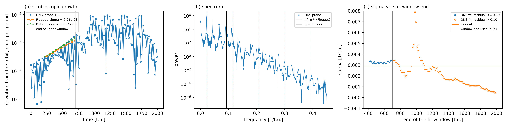

# Cubic Cavity Re=1950 — DNS of the unstable limit cycle

Nonlinear check of the Floquet pair found in
[`../311_stability_direct_floquet/`](../311_stability_direct_floquet/README.md).
Case overview: [`../README.md`](../README.md).

## What it does
The DNS starts from the orbit snapshot at t = 1700 of `../000_dns_period/`
plus 1e-3 times the real part of the leading Floquet eigenvector (`make_ic.py`,
relative perturbation 1e-3 of the velocity rms). It runs 2000 time units with
the same filter and solver tolerances as the Floquet run. One probe at
(0.25, 0.25, 0.25) records `u`, `v`, `w` in `cav.his`. A probe list with two
points gives zeros in this build, so one point is used.

`plot.py` samples the probe once per orbit period `T = 10.78909` and fits the
deviation from the orbit with `d_n = a + b n + Re(c mu^n)`. The term `b n` is the
neutral multiplier `mu = 1` (shift along the orbit) that a period known to
seven digits leaves in the samples. It compares `sigma = ln|mu|/T` and
`omega = arg(mu)/T` with the Floquet pair, and plots the spectrum of the probe
with the lines `n f_1 ± f_F` (`f_1 = 1/T`, `f_F = omega/2pi`).

## Result
Run on 16 ranks of c8, 2000 time units, 13.7 h wall time.

| | sigma [1/t.u.] | omega [rad/t.u.] | period [t.u.] |
|---|---|---|---|
| Floquet, direct (311) | +2.908e-3 | 0.14451 | 43.48 |
| DNS stroboscopic fit | +3.337e-3 | 0.14225 | 44.17 |
| difference | +14.7 % | -1.6 % | |

- The deviation from the orbit grows from 3e-4 to 1.1e-3 between t = 216 and
  t = 701 and then saturates near 9e-3 (probe `u`, order 0.04) after t = 900.
- The window end is set by the fit residual, not by hand: it is the last
  period for which the relative residual of the one-multiplier fit stays below
  0.10 (`RESID_LIMIT` in `plot.py`). Panel (c) shows sigma for every window end.
  For window ends between t = 420 and t = 700 sigma lies between 3.1e-3 and
  3.4e-3, 8 % to 16 % above the Floquet value. A first fit without the drift
  term and with a window that ran into the saturation gave 2.1e-3 and a residual of
  0.32; that fit was wrong because the single-multiplier model does not hold
  past t = 700.
- The spectrum of the probe (t > 200, resolution 5.6e-4) has a peak at
  0.0224 where the Floquet frequency is `f_F = 0.0230` (-2.8 %; the stroboscopic
  fit gives 0.0226). The sidebands `f_1 ± f_F`, `2 f_1 ± f_F` and `3 f_1 ± f_F`
  are peaks within 1.1 % of their predicted frequency, 6 to 44 times the median
  power around them.

The DNS therefore reproduces the frequency of the Floquet pair to 1.6 % and its
growth rate to about 15 %. The remaining difference in `sigma` has not been
traced; it could come from the orbit and the Floquet solver (each converged to
a tolerance) or from the fit.



## Run
The initial field `ic_floq.f00001` is built from the outputs of `../000_dns_period/` and
`../311_stability_direct_floquet/` (field files are not tracked), so run those stages first.
```bash
mks cav
python3 make_ic.py ../311_stability_direct_floquet/BF_cav0.f00001 ../311_stability_direct_floquet/dRecav0.f00001 1e-3 ic_floq.f00001
sbatch run.local.slurm      # 13.7 h on 16 ranks
python3 plot.py             # figure and floquet_vs_dns.dat
uv run --with numpy --with pymech python ../../../scripts/check_against_ref.py .
```
`ref/reference.json` holds the regression value of the DNS growth rate and the two
pass criteria (growth rate within 20 %, frequency within 5 % of the Floquet pair).
